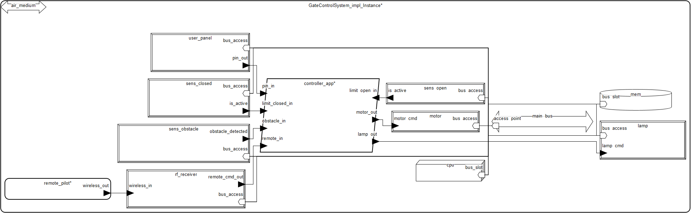
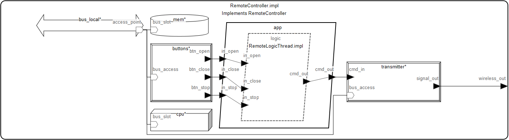
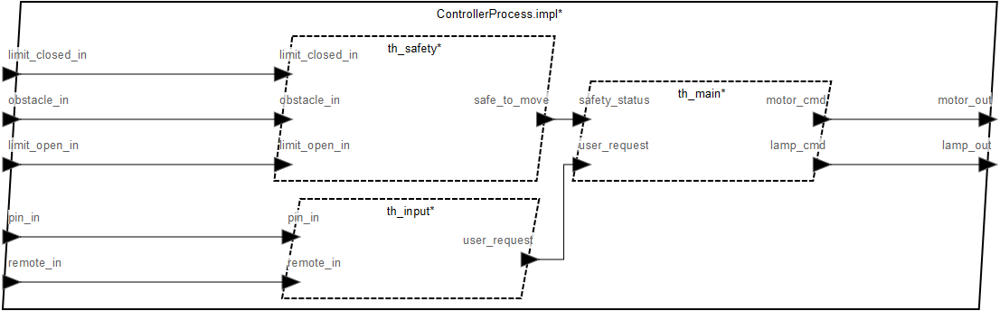
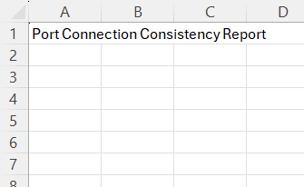
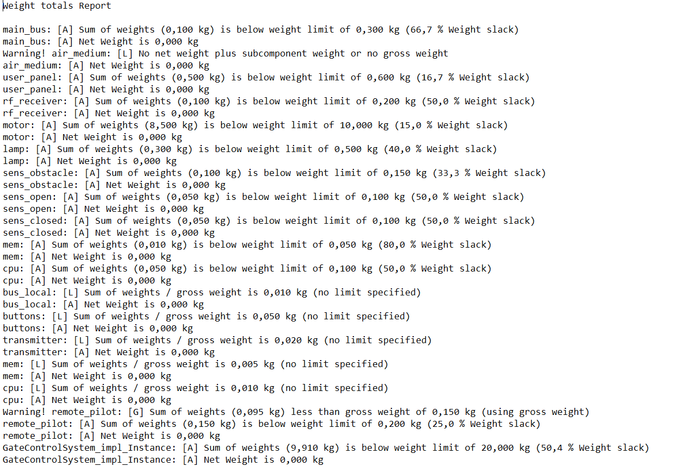

# System Sterowania Automatyczną Bramą Wjazdową w AADL

Model systemu sterowania bramą wjazdową (Gate Control System) zaprojektowany w języku Architecture Analysis & Design Language (AADL) w środowisku OSATE.

## Dane studenta

* **Imię i nazwisko:** Patryk Bochniak
* **E-mail:** pbochniak@student.agh.edu.pl

## Opis modelowanego systemu

### Opis ogólny

Model przedstawia kompletny system automatyki bramowej, uwzględniający zarówno część stacjonarną (brama, silnik, czujniki), jak i zdalną (pilot radiowy). System odpowiada za bezpieczne otwieranie i zamykanie bramy na żądanie użytkownika, z priorytetem bezpieczeństwa (wykrywanie przeszkód).

System składa się z następujących elementów:
* **Podsystemu zdalnego (Pilot)** – niezależny system z własnym zasilaniem i procesorem.
* **Jednostki sterującej bramą (GateCPU)** – główny komputer sterujący.
* **Magistrali Systemowej (SystemBus)** – przewodowe medium komunikacyjne (1.0 Mbps).
* **Medium bezprzewodowego (WirelessEther)** – symulacja medium radiowego ("powietrza").
* **Logiki sterowania** – 3 niezależne wątki realizujące funkcje bezpieczeństwa i sterowania.
* **Urządzeń peryferyjnych** – silnik, lampa ostrzegawcza, panel użytkownika, czujniki krańcowe i przeszkód.

### Opis dla użytkownika

System umożliwia sterowanie bramą w trybie zdalnym oraz lokalnym, zapewniając jednocześnie bezpieczeństwo użytkowania:

1.  **Sterowanie:**
    * **Pilot:** Przyciski Otwórz, Zamknij, Stop.
    * **Panel Użytkownika:** Możliwość wprowadzenia kodu PIN/komendy lokalnej.
2.  **Funkcje wykonawcze:**
    * **Silnik:** Realizuje ruch bramy (Otwieranie/Zamykanie/Stop).
    * **Lampa ostrzegawcza:** Sygnalizuje ruch bramy.
3.  **Funkcje bezpieczeństwa:**
    * **Wykrywanie przeszkód:** Natychmiastowe zatrzymanie bramy w przypadku wykrycia obiektu w świetle bramy.
    * **Krańcówki:** Automatyczne zatrzymanie silnika po osiągnięciu pozycji pełnego otwarcia lub zamknięcia.

## Spis komponentów AADL

### Device (Urządzenia wejściowe)

Fizyczne urządzenia generujące sygnały sterujące i odczyty z sensorów:

| Urządzenie | Opis |
| :--- | :--- |
| **RemoteButtons** | Przyciski fizyczne na pilocie. |
| **UserPanel** | Panel stacjonarny umożliwiający podanie kodu PIN. |
| **RF_Receiver** | Odbiornik radiowy bramy. |
| **ObstacleSensor** | Czujnik bezpieczeństwa (fotokomórka). Wykrywa przeszkody z okresem próbkowania 20ms. |
| **LimitSwitch** | Dwa czujniki (`sens_open`, `sens_closed`) wykrywające skrajne położenia bramy. |

### Device (Urządzenia wyjściowe)

Urządzenia wykonawcze realizujące fizyczne działanie systemu:

| Urządzenie | Opis |
| :--- | :--- |
| **GateMotor** | Główny napęd bramy. Odbiera komendy `GateCommand`. Waga: 8.5 kg. |
| **WarningLamp** | Lampa sygnalizacyjna. Włączana logicznym sygnałem `Boolean`. |
| **RF_Transmitter** | Nadajnik radiowy w pilocie. Wysyła komendy do medium bezprzewodowego. |

### Thread (Wątki)

Niezależne wątki przetwarzające wewnątrz procesu sterownika (`ControllerProcess`) oraz wątek w podsystemie pilota:

| Wątek | Funkcja | Właściwości czasowe |
| :--- | :--- | :--- |
| **SafetyThread** | **Najwyższy priorytet.** Analizuje stan czujnika przeszkód i krańcówek. Decyduje, czy ruch jest bezpieczny. | **Period: 10ms** |
| **MainControlThread** | Podejmuje ostateczną decyzję o wysterowaniu silnika i lampy na podstawie żądań użytkownika i statusu bezpieczeństwa. | **Period: 20ms** |
| **InputThread** | Obsługuje wejścia z panelu użytkownika i komendy zdalne. | **Period: 50ms** |
| **RemoteLogicThread** | Obsługuje przyciski pilota i wysyła komendy. | **Period: 50ms** |

### Process & Processor

* **ControllerProcess:** Główny proces oprogramowania integrujący wątki, uruchamiany na `GateCPU`.
* **RemoteApp:** Główny proces pilota.
* **GateCPU:** Jednostka obliczeniowa bramy (100 MIPS).
* **RemoteCPU:** Procesor wbudowany w pilota (10 MIPS).

### Bus (Komunikacja)

* **SystemBus:** Główna magistrala przewodowa łącząca CPU, Pamięć i urządzenia bramy (1 Mbps).
* **RemoteBus:** Wewnętrzna magistrala pilota.
* **WirelessEther:** Abstrakcja medium radiowego łącząca nadajnik pilota z odbiornikiem bramy (10 Kbps).

## Diagramy modelu

### 1. Diagram główny
Przedstawia główny system bramy wjazdowej.

### 2. Diagram pilota
Przedstawia podsystem pilota.

### 3. Diagram procesu controller_app
Przedstawia proces controller_app z wątkami.

## Analiza modelu

Model został poddany weryfikacji pod kątem połączeń oraz analizie wagowej.

### 1. Spójność połączeń (Port Connection Consistency)
Przeprowadzono analizę spójności połączeń portów.
* **Wynik:** Raport `Port Connection Consistency` nie wykazał błędów.
  

* **Wniosek:** Architektura poprawnie uwzględnia media transmisyjne.

### 2. Analiza Wagowa (Weight Analysis)
Przeprowadzono analizę masy systemu w celu weryfikacji zgodności z ograniczeniami konstrukcyjnymi.

**Założenia:**
* Limit wagi dla całego systemu (`GateControlSystem`): **20.0 kg**
* Limit wagi dla pilota (`RemoteController`): **0.2 kg**

**Wyniki (na podstawie wygenerowanego raportu):**
* **Całkowita waga systemu:** 9.910 kg
* **Zapas wagi (Slack):** 50.4% (10.09 kg zapasu).
* **Najcięższy komponent:** Silnik (`motor`) – 8.5 kg.
* **Waga pilota:** 0.150 kg (poniżej limitu 0.200 kg).

Szczegółowy zrzut z raportu wagowego:

### 3. Wyniki analizy spójności
System nie wykazuje błędów w spójności portów ani magistral:

## Wnioski

1.  **Poprawność Architektury:** Model jest spójny logicznie i sprzętowo.
2.  **Konstrukcja Mechaniczna:** System mieści się w założonych limitach wagowych z dużym marginesem bezpieczeństwa (ponad 50%), co pozwala na ewentualne zastosowanie cięższych, bardziej wytrzymałych podzespołów (np. mocniejszego silnika) bez naruszania wymagań.
3.  **Bezpieczeństwo:** Zastosowanie najkrótszego okresu próbkowania (10ms) dla wątku bezpieczeństwa (`SafetyThread`) zapewnia szybką reakcję na wykrycie przeszkody.

## Literatura

1.  SAE International, "AS5506C: Architecture Analysis & Design Language (AADL)," SAE International Standard, 2017.
2.  P. H. Feiler and D. P. Gluch, *Model-Based Engineering with AADL: An Introduction to the SAE Architecture Analysis & Design Language*, Addison-Wesley Professional, 2012.
3.  OSATE 2 - Open Source AADL Tool Environment. Available: https://osate.org/
